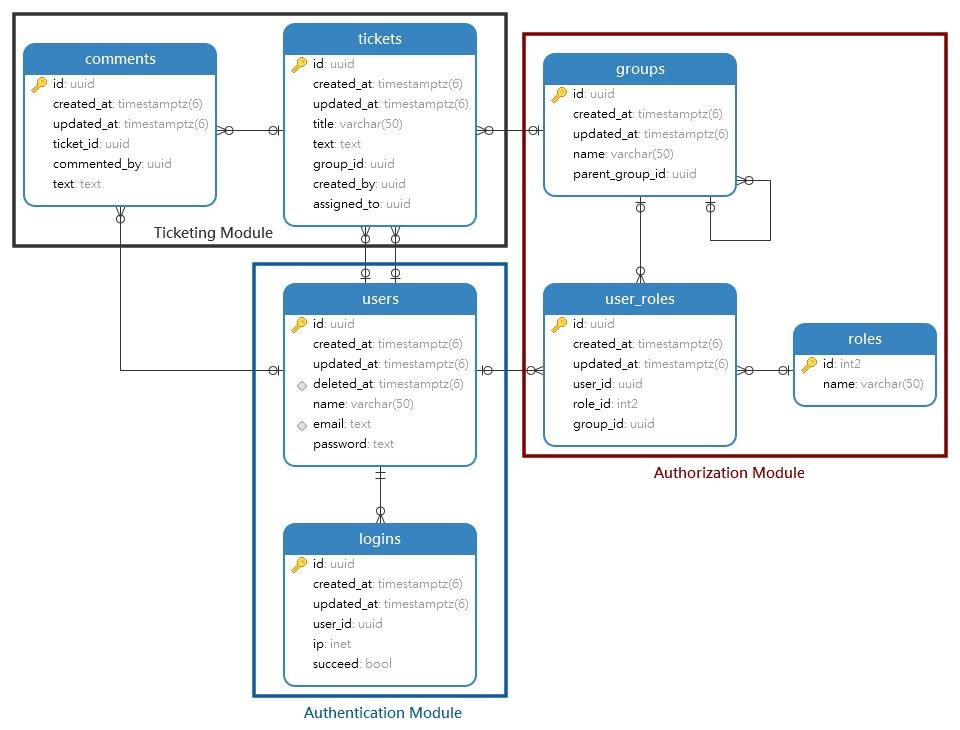

<a name="readme-top"></a>
[![Contributors][contributors-shield]][contributors-url]
[![Forks][forks-shield]][forks-url]
[![Stargazers][stars-shield]][stars-url]
[![Issues][issues-shield]][issues-url]
[![MIT License][license-shield]][license-url]

<!-- PROJECT LOGO -->
<br />
<div align="center">

<h1 align="center">GopherTix</h1>

  <p align="center">
    A modular system with clean architecture for managing user tickets across teams efficiently
    <br />
    <a href="https://github.com/ariantron/GopherTix/issues">Report Bug</a>
    ·
    <a href="https://github.com/ariantron/GopherTix/issues">Request Feature</a>
  </p>
</div>

<!-- TABLE OF CONTENTS -->
<details>
  <summary>Table of Contents</summary>
  <ol>
    <li>
      <a href="#about-the-project">About The Project</a>
      <ul>
        <li><a href="#built-with">Built With</a></li>
      </ul>
    </li>
    <li>
      <a href="#getting-started">Getting Started</a>
      <ul>
        <li><a href="#installation">Installation</a></li>
      </ul>
    </li>
    <li><a href="#license">License</a></li>
    <li><a href="#contact">Contact</a></li>
  </ol>
</details>

<!-- ABOUT THE PROJECT -->

## About The Project

GopherTix is a modular system with a clean architecture implemented by GoLang and Fiber framework for efficiently
managing user tickets across teams. It includes the following core modules:

1. **Authentication**: Securely manage user accounts and login processes.
2. **Authorization**: Define and enforce user roles and access control policies.
3. **Ticketing**: Manage ticket creation and facilitate commenting.

Each module is built with scalability and performance in mind, leveraging GoLang for its simplicity and speed.

### Built With

* [![GoLang][GoLang]][GoLang-url]
* [![Postgres][Postgres]][Postgres-url]
* [![Gorm][Gorm]][Gorm-url]
* [![Fiber][Fiber]][Fiber-url]

<p align="right">(<a href="#readme-top">back to top</a>)</p>

<!-- GETTING STARTED -->

## Getting Started

### Installation

Clone the repository and navigate to the project directory:

```bash
$ git clone https://github.com/ariantron/GopherTix.git
$ cd gophertix
```

Install dependencies and run the application:

```bash
# Install Go dependencies
$ go mod tidy

# Start the application
$ go run ./app/main.go
```

### Environment Variables

Copy the `.env.example` file to `.env` and fill in the required environment variables:

```bash
$ cp .env.example .env
```

<p align="right">(<a href="#readme-top">back to top</a>)</p>

<!-- DATABASE -->

## Database



<p align="right">(<a href="#readme-top">back to top</a>)</p>

<!-- LICENSE -->

## License

Distributed under the MIT License. See `LICENSE` for more information.

<p align="right">(<a href="#readme-top">back to top</a>)</p>

<!-- MARKDOWN LINKS & IMAGES -->

[contributors-shield]: https://img.shields.io/github/contributors/ariantron/gophertix.svg?style=for-the-badge

[contributors-url]: https://github.com/ariantron/GopherTix/graphs/contributors

[forks-shield]: https://img.shields.io/github/forks/ariantron/gophertix.svg?style=for-the-badge

[forks-url]: https://github.com/ariantron/GopherTix/network/members

[stars-shield]: https://img.shields.io/github/stars/ariantron/gophertix.svg?style=for-the-badge

[stars-url]: https://github.com/ariantron/GopherTix/stargazers

[issues-shield]: https://img.shields.io/github/issues/ariantron/gophertix.svg?style=for-the-badge

[issues-url]: https://github.com/ariantron/GopherTix/issues

[license-shield]: https://img.shields.io/github/license/ariantron/gophertix.svg?style=for-the-badge

[license-url]: https://github.com/ariantron/GopherTix/blob/master/LICENSE

[GoLang]: https://img.shields.io/badge/go-%2300ADD8.svg?style=for-the-badge&logo=go&logoColor=white

[GoLang-url]: https://golang.org

[Postgres]: https://img.shields.io/badge/postgres-%23336791.svg?style=for-the-badge&logo=postgresql&logoColor=white

[Postgres-url]: https://www.postgresql.org

[Gorm]: https://img.shields.io/badge/gorm-%234ea94b.svg?style=for-the-badge&logo=go&logoColor=white

[Gorm-url]: https://gorm.io

[Fiber]: https://img.shields.io/badge/fiber-%23E0234E.svg?style=for-the-badge&logo=go&logoColor=white

[Fiber-url]: https://gofiber.io
